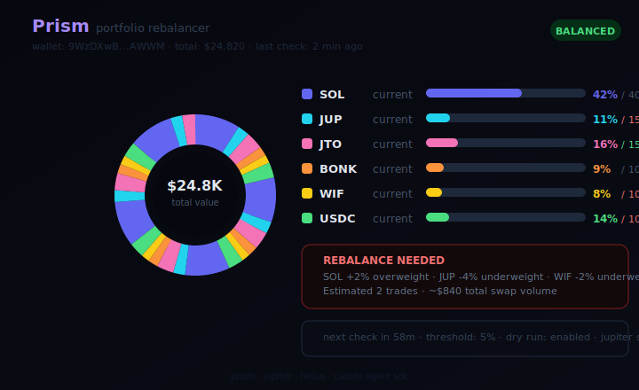
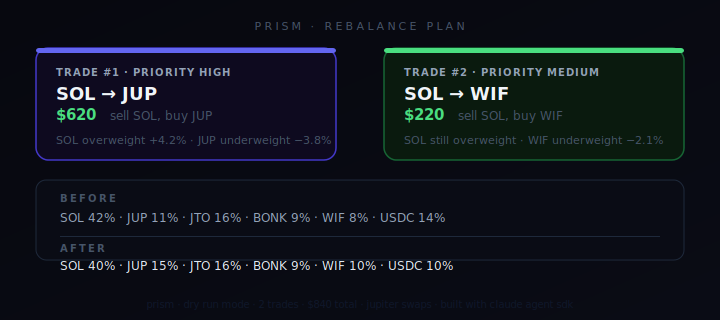

<div align="center">

# Prism

**Drift-aware portfolio rebalancer for Solana wallets.**
Prism tracks allocation drift, prices the cost of correcting it, and produces a rebalance plan that is meant to be executable, not just mathematically tidy.

[](https://github.com/PrismRebalance/Prism/actions)

[](https://docs.anthropic.com/en/docs/agents-and-tools/claude-agent-sdk)

</div>

---

Rebalancing sounds simple until the wallet is real. One token runs too far, another becomes too small, and the clean target allocation you wanted starts colliding with price impact, minimum trade size, and the need to keep some SOL in reserve. Prism is built around those real frictions.

It watches a Solana wallet, measures drift against a target portfolio, and generates a prioritized trade list only when the deviation is worth fixing. The system is intentionally practical: if a rebalance route is too small, too expensive, or leaves the wallet under-reserved, the order is flagged instead of being dressed up as a perfect plan.

`FETCH WALLET -> MEASURE DRIFT -> BUILD PLAN -> PREFLIGHT -> EXECUTE OR PREVIEW`

---

Portfolio Dashboard - Rebalance Plan - At a Glance - Operating Surfaces - How It Works - Example Output - Drift Model - Risk Controls - Quick Start

## At a Glance

- `Use case`: keeping a Solana wallet close to a target allocation without manual spreadsheet work
- `Primary input`: wallet balances, token prices, target percentages, quote quality, and execution friction
- `Primary failure mode`: generating mathematically correct rebalances that are not actually worth executing
- `Best for`: operators who want discipline around allocation drift, not just portfolio visibility

## Portfolio Dashboard



## Rebalance Plan



## Operating Surfaces

- `Portfolio Dashboard`: shows current wallet composition versus the intended target mix
- `Drift Engine`: calculates which assets are over target, under target, or close enough to leave alone
- `Planner`: converts drift into specific buy and sell legs with priority ordering
- `Preflight`: checks route quality, price impact, and reserve constraints before any execution is accepted

## Why Prism Exists

Most portfolio trackers are observational. They tell you what happened to your wallet and leave the hard part to you. Prism is for the step after that. It answers whether the drift is large enough to matter, what trades would correct it, and whether those trades still make sense after real routing costs are considered.

That last part matters. A rebalance engine that ignores execution friction is not a portfolio tool. It is just algebra.

## How It Works

Prism follows a five-part loop:

1. load current wallet balances and price them in USD
2. compare the live portfolio against the configured target allocation
3. compute drift for every tracked asset and rank the deviations
4. build rebalance orders that move the portfolio back toward target
5. preflight the candidate orders for price impact, minimum size, and SOL reserve safety

Only the orders that survive preflight should be thought of as real. Everything else is useful as analysis, but not as an execution plan.

## What A Good Rebalance Plan Looks Like

The best Prism plan is usually boring:

- a few meaningful corrections instead of a large number of tiny trades
- obvious overweights are trimmed before minor underweights are filled
- price impact stays within tolerance
- the wallet keeps enough SOL for ongoing activity

Prism is not trying to chase perfection on every cycle. It is trying to keep the portfolio disciplined without burning value in friction.

## Example Output

```text
PRISM // REBALANCE PLAN

wallet value        $12,440
largest drift       SOL +8.2%
mode                dry-run

1. sell SOL -> buy USDC   $620   executable
2. sell BONK -> buy JTO   $180   executable
3. buy JUP using USDC      $95   skipped: below min trade
```

## Drift Model

Prism compares each live position to its target weight:

`driftPct = currentPct - targetPct`

That sounds straightforward, but the execution layer makes the system useful:

- tiny drifts are ignored if they do not justify trading
- orders are priced against live quotes before they are accepted
- high-impact routes are demoted or skipped
- SOL reserve protection prevents the engine from rebalancing too aggressively

This is why Prism behaves more like a desk tool than a toy allocator.

## Default Target Allocation

| Token | Target | Role |
|-------|--------|------|
| SOL | 40% | core Solana exposure |
| JUP | 15% | DEX infrastructure |
| JTO | 15% | liquid staking |
| BONK | 10% | community beta |
| WIF | 10% | meme sleeve |
| USDC | 10% | reserve and dry powder |

Customize the target mix in [`src/targets.ts`](src/targets.ts).

## Risk Controls

- `rebalance threshold`: ignores small drift that is not worth paying to correct
- `minimum trade size`: stops dust-level corrections from cluttering the plan
- `price impact cap`: marks expensive routes as non-executable
- `SOL reserve floor`: protects the wallet from rebalancing away too much operating balance
- `dry-run mode`: lets operators inspect the plan before allowing execution

Prism should be trusted as a disciplined allocator, not as a license to overtrade the wallet every time prices move.

## Quick Start

```bash
git clone https://github.com/PrismRebalance/Prism
cd Prism
bun install
cp .env.example .env
bun run dev
```

## Configuration

```bash
ANTHROPIC_API_KEY=sk-ant-...
HELIUS_API_KEY=...
WALLET_ADDRESS=your-wallet
REBALANCE_THRESHOLD_PCT=5
MIN_TRADE_USD=50
MAX_PRICE_IMPACT_PCT=1.5
MIN_SOL_RESERVE=0.1
DRY_RUN=true
CHECK_INTERVAL_MS=3600000
```

## License

MIT

---

*keep the portfolio close to target without pretending friction does not exist.*
